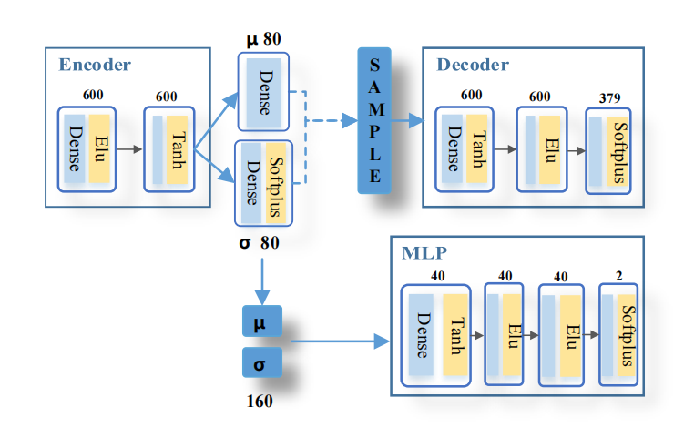
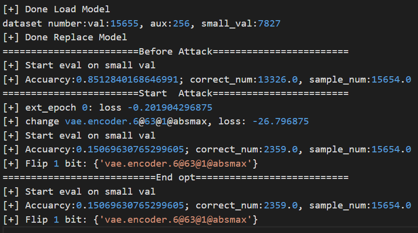

模型原始结构

训练和原始结构和步骤一致。推理阶段，我只使用MLP的输出，没有使用decoder的输出；
如果按照原论文的参数，加入decoder输出参数进行判断对判断结果没有影响。（所有样本的loss均大于要求）
只使用MLP的输出作为判断依据，成功率在85%左右，比原论文90%略低；

使用untarget的bitflip attack，一个bit翻转就可以从85%正确率降低到15%

